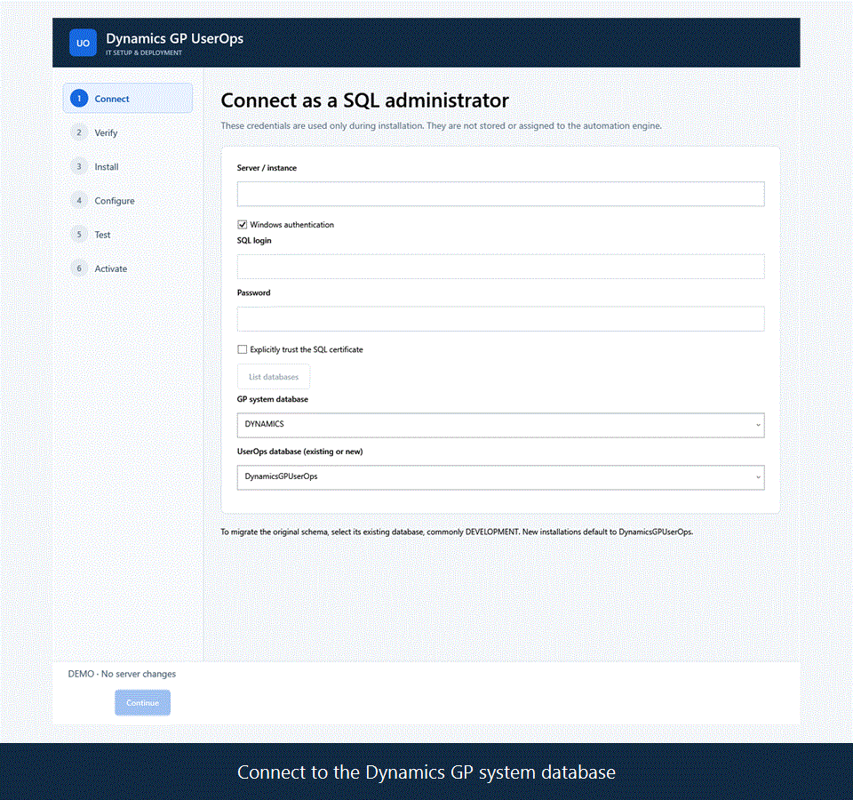
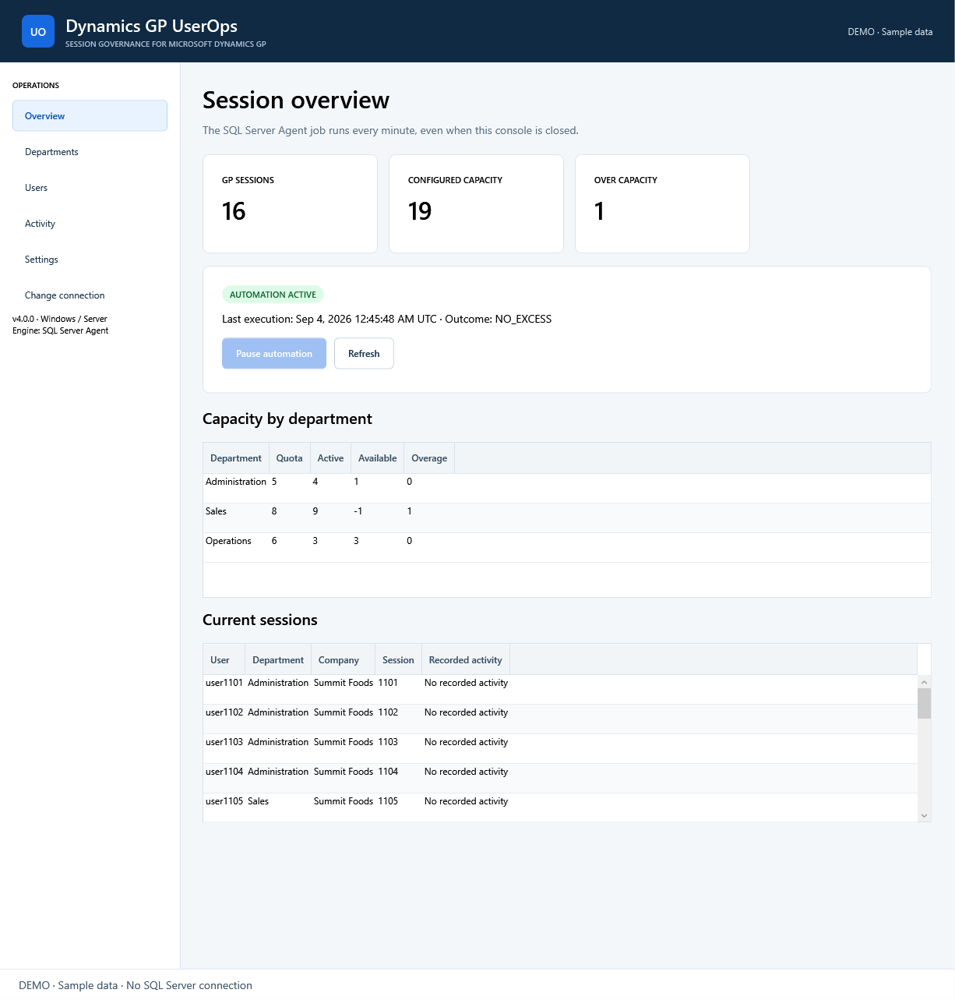
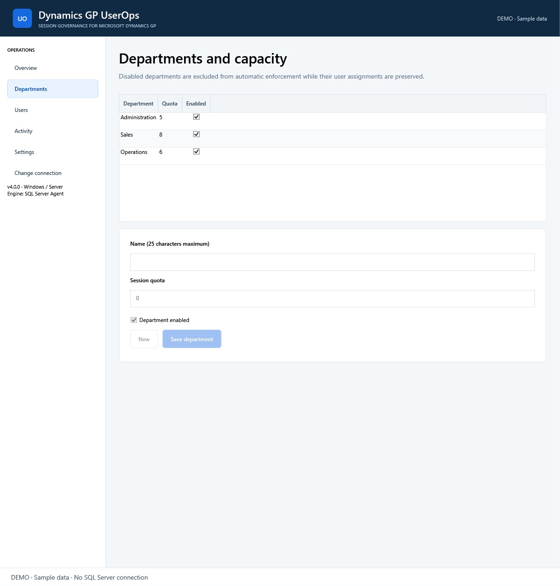
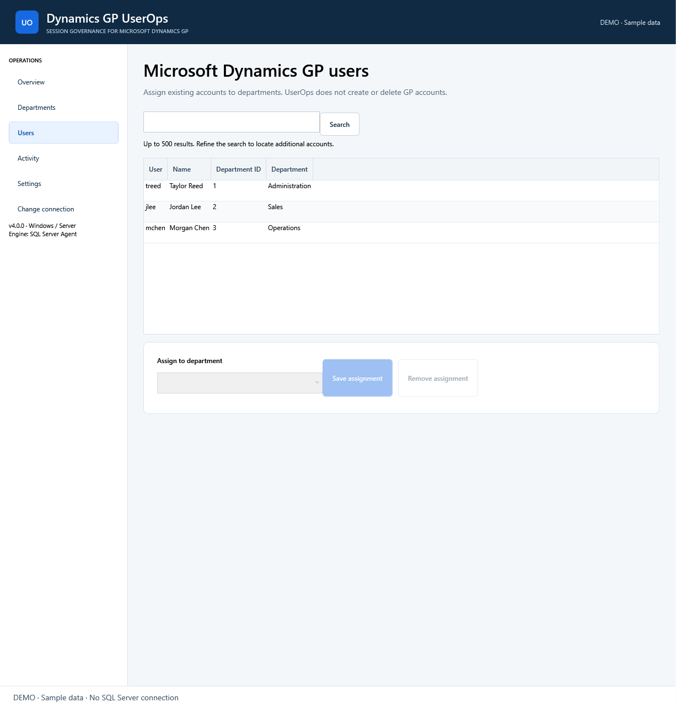
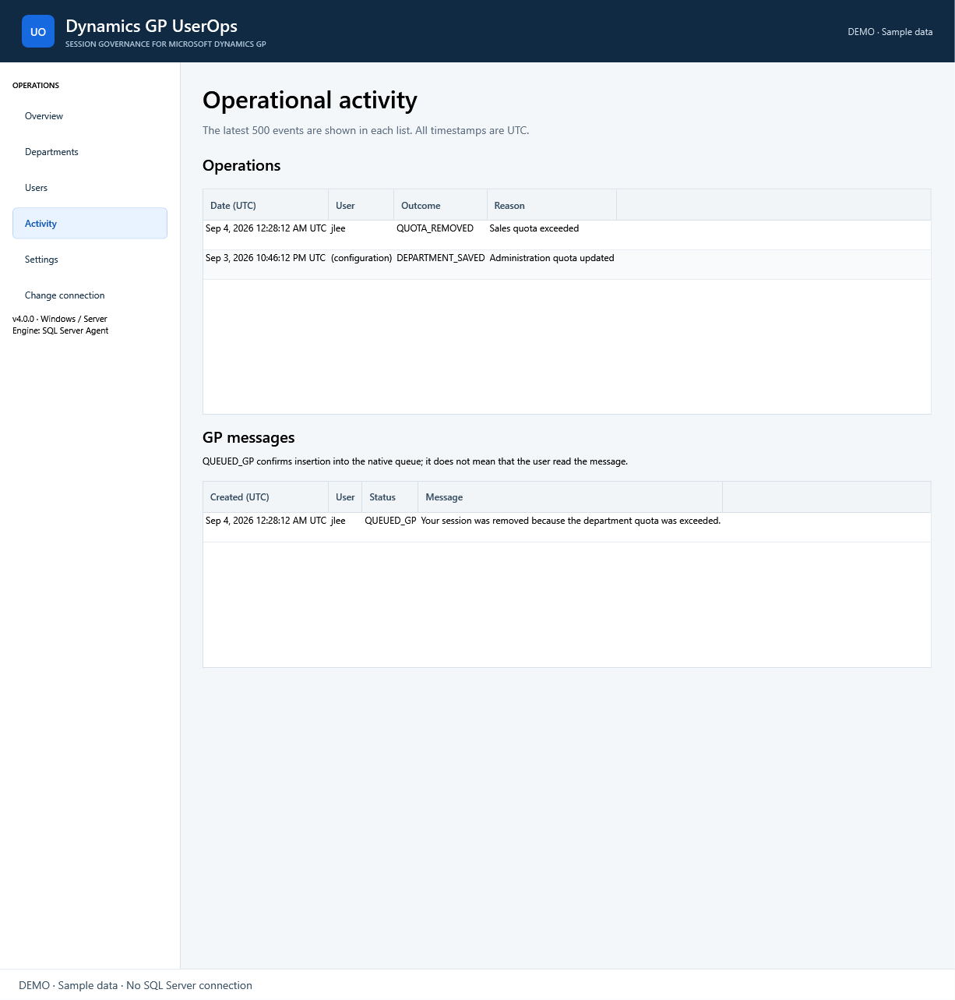

<p align="center">
  
</p>

<h1 align="center">Dynamics GP UserOps</h1>

<p align="center">
  Session capacity governance for Microsoft Dynamics GP—without giving operators direct SQL access.
</p>

<p align="center">
  <a href="https://github.com/juanrovalle/dynamics-gp-users-manager/actions/workflows/windows-build.yml"></a>
  <a href="https://github.com/juanrovalle/dynamics-gp-users-manager/actions/workflows/sql-tests.yml"></a>
  <a href="LICENSE"></a>
  
</p>

<p align="center">
  <a href="#quick-start">Quick start</a> ·
  <a href="#screenshots">Screenshots</a> ·
  <a href="docs/index.html">English / Español guides</a> ·
  <a href="https://github.com/juanrovalle/dynamics-gp-users-manager/releases">Releases</a> ·
  <a href="CHANGELOG.md">Changelog</a>
</p>



<p align="center"><sub>30-second product tour using synthetic demo data. Demo mode makes no SQL Server changes.</sub></p>

## The problem it solves

Dynamics GP environments often have a fixed number of concurrent user seats, while access demand varies by department. Managing that pressure manually means checking sessions, editing SQL, interrupting users without context, and relying on tribal knowledge.

Dynamics GP UserOps gives IT a controlled Windows deployment and gives authorized GP operators a focused console for day-to-day capacity management.

| Operational challenge | Dynamics GP UserOps response |
| --- | --- |
| Departments exceed their assigned session capacity | Enforces configurable quotas once per minute through SQL Server Agent |
| Business users should not administer SQL Server Agent | Provides scoped SQL roles and an application-level pause/resume control |
| Session removal can interrupt active work | Supports preview, confirmation, activity protection, audit history, and native GP messages |
| Manual SQL implementations are difficult to support | Ships versioned migrations, preflight checks, diagnostics, and a self-contained Windows installer |

## Quick start

1. Download `Setup.exe` and `Setup.exe.sha256` from [GitHub Releases](https://github.com/juanrovalle/dynamics-gp-users-manager/releases), verify the checksum, and verify the publisher signature when the package is identified as signed.
2. Run Setup on a supported Windows 11 or Windows Server Desktop Experience computer. Connect to the GP system database and complete **Connect → Verify → Install → Configure → Test**.
3. Confirm the test message in a real Dynamics GP client, review the removal policy, and select **Activate**. New installations remain paused until this final action.

Setup includes the .NET runtime, application, migrations, license, and offline documentation. Customer computers do not need `sqlcmd`, IIS, an existing .NET installation, or Internet access during installation.

For production deployment, follow the complete [installation and testing guide](docs/installation-and-testing.en.html) or the [Windows Server guide](docs/windows-server.en.html). Spanish versions are available from the [guide selector](docs/index.html).

## What you can manage

- Monitor current GP sessions, departmental capacity, overages, automation state, and recent execution.
- Create, edit, disable, and assign quotas to departments.
- Assign existing Dynamics GP users to departments without creating or modifying GP accounts.
- Preview the next enforcement candidate before removing any session.
- Pause or activate the server-side automation without granting general SQL Server Agent administration.
- Review removals, blocked operations, errors, and native GP messages in one activity history.
- Export password-free diagnostics for support.

## Screenshots

| Capacity overview | Department quotas |
| --- | --- |
|  |  |

| User assignments | Operations and GP messages |
| --- | --- |
|  |  |

All screenshots use synthetic data. The application UI is English; Setup and offline deployment guides are available in English and Spanish.

## Common use cases

- **Departmental capacity governance:** reserve concurrent-session capacity for Finance, Sales, Operations, or other business units.
- **Shared or hosted GP environments:** centralize policy for RDS, Citrix, and multi-office deployments while keeping the console off GP workstations.
- **Delegated operations:** let an authorized GP administrator manage quotas and assignments without writing SQL.
- **Controlled enforcement:** preview candidates, protect sessions with recorded GP activity, remove no more than one session per run, and retain an audit trail.
- **User communication:** queue a native GP message when a session is removed and separately verify delivery during deployment acceptance.
- **Support and compliance:** export diagnostics without passwords and review the last 500 operational and notification events.

## How it works

The WPF console manages configuration in the UserOps database. SQL Server Agent executes the enforcement procedure every minute—even when the console is closed—and records every outcome before optionally posting through the compatible Dynamics GP native-message schema.

The engine serializes concurrent executions, rechecks the selected session under locks, removes at most one session per run, and rolls back the removal if audit or notification insertion fails. Forced record removal is not a graceful Dynamics GP logout and does not terminate the GP process or SQL connection.

## Platform and safety

- Windows 11 x64 or Windows Server 2016, 2019, 2022, or 2025 x64 with Desktop Experience.
- SQL Server 2016 SP1 or later with SQL Server Agent. SQL Server Express is not supported by this distribution.
- Self-contained .NET 10 desktop application; no runtime installation is required on the customer computer.
- Windows or existing SQL identities with separate installation, operation, and job permissions.
- SQL passwords are held only for the active session and are not stored in profiles, logs, or diagnostics.
- Uninstall removes Windows application files only; it does not silently delete SQL data or stop the engine.

See the [compatibility and verification status](docs/compatibility.md) before deployment. Validate the exact Windows, SQL Server, Dynamics GP, GP client, and native-message schema combination before enabling enforcement for business users.

## Releases and changelog

- **Current version:** Dynamics GP UserOps 4.0.0
- **Installers and checksums:** [GitHub Releases](https://github.com/juanrovalle/dynamics-gp-users-manager/releases)
- **Version history:** [CHANGELOG.md](CHANGELOG.md)
- **Detailed 4.0.0 notes:** [Release notes](docs/release-notes.md)
- **Commercial delivery scope:** [Commercialization](docs/commercialization.md)

Release packages should contain `Setup.exe`, `Setup.exe.sha256`, release notes, and a clear signed/unsigned status. A commercial build should be Authenticode-signed before distribution.

## Build from source

Developer prerequisites are Windows, the .NET 10 SDK selected by `global.json`, NuGet access, and Inno Setup 7.

```powershell
dotnet run --project tests/DynamicsGP.UserOps.Tests
.\build.ps1 -InnoCompiler 'C:\Program Files\Inno Setup 7\ISCC.exe'
```

The installer is written to `artifacts/installer/Setup.exe`. To regenerate the README demo and gallery from an approved screenshot set:

```powershell
.\packaging\Generate-ReadmeMedia.ps1 -SourceDirectory 'C:\path\to\Screenshots\100'
```

See [automated tests](tests/README.md) for the SQL integration, platform-policy, migration, and screenshot workflows.

## Support the project

If Dynamics GP UserOps saves your team time or gives you a useful foundation for Dynamics GP operations:

**⭐ Star this repo if it helps you.**

Contributions and reproducible issue reports are welcome. Include product version, Windows build, SQL Server version, Dynamics GP build, and sanitized diagnostic output.

## License and product notice

This repository is licensed under the [MIT License](LICENSE). Commercial implementation and support services do not replace or restrict that license. Third-party components retain their own licenses.

Microsoft Dynamics GP is a trademark or product of Microsoft. Dynamics GP UserOps is an independent product and is not affiliated with, endorsed by, sponsored by, or supported by Microsoft.
